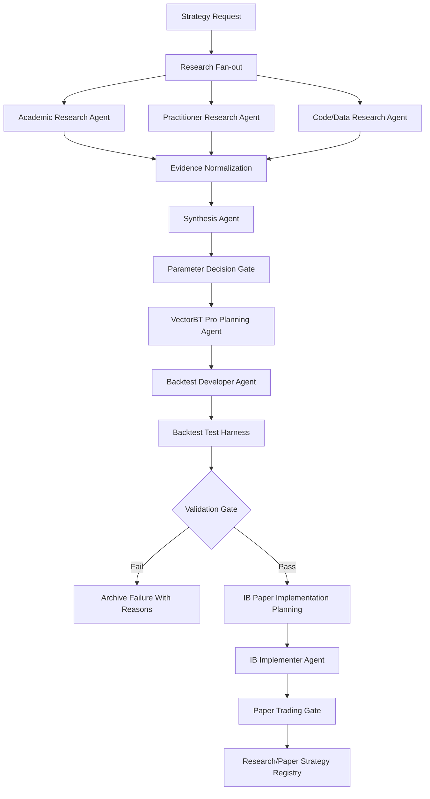

# Strategy Research Factory Design

Version: 0.1 - May 2026

Status: Companion design for `Multi_Tier_Agentic_Workflow_v2.md` and `trading_app_workflow_design_v2.md`

## 1. Purpose

This document extends the trading-app design with a governed research-to-implementation factory. The goal is to let agents discover, justify, backtest, and promote strategy ideas without weakening the core safety rule:

```text
Agents may propose strategies.
Backtests may validate hypotheses.
Policy gates decide promotion.
Live execution remains disabled until paper trading, replay, audit, and risk controls pass.
```

The new workflow does not replace the existing daily trading pipeline. It adds an upstream strategy development pipeline that can generate validated strategy modules for later inclusion in research-only or paper-trading workflows.

## 2. Design Position

The existing six-tier architecture remains valid.

| Existing Tier | New Responsibility |
|---|---|
| Tier 0 - Governance & Policy | Defines promotion gates, benchmark requirements, execution permissions, and human approval checkpoints |
| Tier 1 - Interface | Accepts strategy research requests and displays dossiers, backtests, and promotion decisions |
| Tier 2 - Orchestrator | Runs the research factory as a durable staged workflow |
| Tier 3 - Specialist Agents | Adds research, synthesis, planning, development, testing, and IB implementation agents |
| Tier 4 - Tools & Services | Adds literature search, repo search, VectorBT Pro backtesting, benchmark services, and IB paper-trading adapters |
| Tier 5 - Data & Memory | Stores research evidence, parameter decisions, backtest runs, benchmark ranges, and promotion records |
| Tier 6 - Observability | Tracks citations, run lineage, test results, parameter sweeps, failures, costs, and promotion decisions |

This is best treated as a long-running, replayable workflow rather than a one-shot chat interaction.

## 3. High-Level Workflow



## 4. Agent Roles

### 4.1 Research Agents

Three research agents run in parallel and produce structured evidence, not prose-only summaries.

| Agent | Sources | Output |
|---|---|---|
| Academic Research Agent | Papers, preprints, textbooks, institutional research | Hypotheses, parameter ranges, market assumptions, caveats |
| Practitioner Research Agent | Quant blogs, broker notes, practitioner writeups, newsletters | Implementation details, practical constraints, cost assumptions |
| Code/Data Research Agent | GitHub, Kaggle, notebooks, public examples | Existing code patterns, data requirements, reproducibility notes |

Each source must be classified by quality, recency, relevance, and reproducibility. Agents may cite and summarize, but they must not fabricate results, parameters, or source claims.

### 4.2 Synthesis Agent

The synthesis agent reasons across the evidence and produces justified choices. Its job is not to average parameters.

It must select:

- primary strategy hypothesis
- eligible asset universe
- entry and exit rules
- rebalance cadence
- lookback windows
- risk limits
- transaction cost assumptions
- benchmark ranges
- expected validation metrics

Every material parameter must have:

- selected value
- allowed range
- source support
- reason for choosing it
- sensitivity expectation
- rejection notes for plausible alternatives

### 4.3 VectorBT Pro Planning Agent

The planning agent maps the strategy to VectorBT Pro concepts before code is written.

It must specify:

- data shape and frequency
- signal generation method
- portfolio construction method
- order sizing model
- fees, slippage, and borrow assumptions
- parameter grid
- benchmark portfolios
- output metrics
- reproducibility seed and run config

The plan should prefer VectorBT Pro's vectorized portfolio workflow and parameter-grid strengths when the strategy can be expressed cleanly as arrays. If an event-driven simulation is required, the planner must say why.

### 4.4 Developer Agent

The developer agent writes backtest code from the approved plan. It does not choose new strategy logic unless the workflow is sent back to planning.

Required properties:

- deterministic inputs
- explicit data dependencies
- no hidden network calls inside metric computation
- no lookahead leakage
- isolated configuration
- reproducible output artifacts
- typed result object

### 4.5 Tester Agent

The tester agent runs a staged validation harness. The "six runs" pattern is useful, but the system should enforce gates by evidence rather than raw run count.

Minimum runs:

- 3 syntax/smoke runs: import, fixture data, small sample, full configured period
- 3 parameter validation runs: baseline, selected parameters, sensitivity grid

Additional required checks:

- train/test or walk-forward split
- transaction cost and slippage stress
- benchmark comparison
- parameter sensitivity
- data leakage scan
- survivorship and universe-bias review
- failure archive when validation does not pass

### 4.6 IB Planning Agent

The IB planning agent runs only after the backtest validation gate passes. It maps the strategy to paper-trading execution mechanics.

It must define:

- contract qualification
- market data requirements
- schedule
- order type
- position sizing
- fill handling
- reconciliation
- disconnect behavior
- idempotency keys
- cancel/replace policy
- paper-trading-only limits

### 4.7 IB Implementer Agent

The implementer agent writes production-ready paper-trading code. Live trading remains disabled by policy until a later explicit promotion.

Required behavior:

- connection lifecycle management
- timeout and retry handling
- order status tracking
- partial fill handling
- fill reconciliation against local state
- structured audit logging
- dry-run and paper modes
- no live order path unless policy enables it

## 5. Core Artifacts

The workflow should persist artifacts at each stage so every promotion can be replayed and audited.

| Artifact | Purpose |
|---|---|
| `StrategyRequest` | User or system request for a strategy research workflow |
| `EvidenceSource` | Normalized source metadata and extracted claims |
| `ResearchDossier` | Combined research output from all research agents |
| `ParameterDecision` | Chosen parameters with citations and rejected alternatives |
| `BacktestSpec` | VectorBT Pro implementation plan |
| `BacktestRun` | One executable run, config, data fingerprint, and result |
| `ValidationReport` | Gate decision with benchmark comparisons and failure reasons |
| `ExecutionPlan` | IB paper-trading implementation plan |
| `PromotionDecision` | Durable record of whether the strategy may advance |

## 6. State Machine

```text
DRAFT_REQUEST
RESEARCH_RUNNING
RESEARCH_COMPLETE
SYNTHESIS_COMPLETE
BACKTEST_PLANNED
BACKTEST_CODED
BACKTEST_TESTING
BACKTEST_FAILED
BACKTEST_VALIDATED
IB_PLANNED
IB_CODED
PAPER_READY
PAPER_RUNNING
PAPER_FAILED
PAPER_VALIDATED
LIVE_BLOCKED_PENDING_HUMAN_APPROVAL
```

No state transition should be inferred from an agent message alone. State changes require schema-valid artifacts and policy approval.

## 7. Promotion Gates

### Gate A - Research Sufficiency

Minimum requirements:

- at least one credible source for the strategy premise
- at least one independent source for parameter range or benchmark expectation
- clear statement of data requirements
- known failure modes listed
- source quality recorded

### Gate B - Parameter Decision

Minimum requirements:

- every material parameter is justified
- selected parameters are inside source-supported or explicitly reasoned ranges
- rejected alternatives are documented
- benchmark expectations are pre-registered before testing

### Gate C - Backtest Validity

Minimum requirements:

- code passes syntax and smoke tests
- selected strategy beats configured benchmarks after costs
- drawdown is within acceptable bounds
- sensitivity grid does not show a single-point artifact
- no known lookahead, leakage, or survivorship issue remains unresolved
- result is reproducible from stored config and data fingerprint

### Gate D - IB Paper Readiness

Minimum requirements:

- IB implementation is paper-trading only
- order lifecycle and fill management are implemented
- local state reconciliation exists
- audit logging records every submitted, cancelled, filled, rejected, and reconciled order
- kill switch and risk limits are enforceable outside the LLM

## 8. Data and Storage

Recommended SQLite tables:

```text
strategy_requests
evidence_sources
research_dossiers
parameter_decisions
backtest_specs
backtest_runs
validation_reports
execution_plans
promotion_decisions
strategy_registry
```

Recommended file artifacts:

```text
artifacts/research/<strategy_id>/dossier.json
artifacts/research/<strategy_id>/citations.json
artifacts/backtests/<strategy_id>/<run_id>/config.json
artifacts/backtests/<strategy_id>/<run_id>/metrics.json
artifacts/backtests/<strategy_id>/<run_id>/tearsheet.html
artifacts/execution/<strategy_id>/paper_plan.json
```

## 9. Integration With Existing Trading App

The strategy factory should initially run on demand, separate from the daily pipeline.

Recommended first integration path:

1. Add schemas and persistence for strategy research artifacts.
2. Add a manual CLI workflow for `research_strategy`.
3. Add VectorBT Pro planning and backtest spec generation.
4. Add a local backtest harness with fixture data.
5. Add validation reports and promotion decisions.
6. Add paper-trading-only IB planning.
7. Add IB implementation after the paper gate design is implemented.

The daily pipeline may consume only strategies with status `PAPER_READY` or above, and even then only as research candidates until policy allows otherwise.

## 10. Non-Negotiables

- No live trading path is generated from a research workflow.
- No benchmark ranges are chosen after seeing backtest results.
- No agent can promote its own code without a validation report.
- No parameter tuning loop may optimize directly on the final evaluation window.
- No result is accepted without costs and slippage assumptions.
- No IB code can submit orders without explicit paper/live mode enforcement.

## 11. Bottom Line

This extension makes the trading app more powerful, but it also raises the bar for governance. The right design is not "agents discover a strategy and trade it." The right design is:

```text
agents discover and justify;
services test and validate;
policy decides promotion;
execution stays constrained.
```

